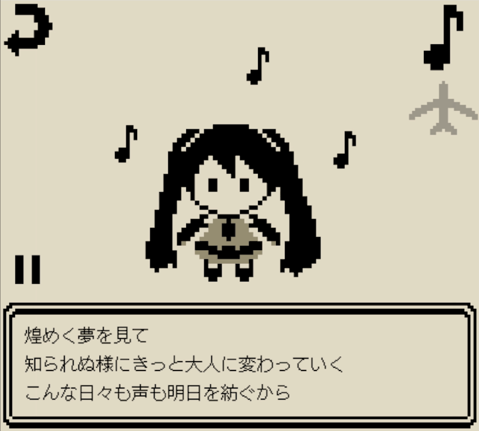
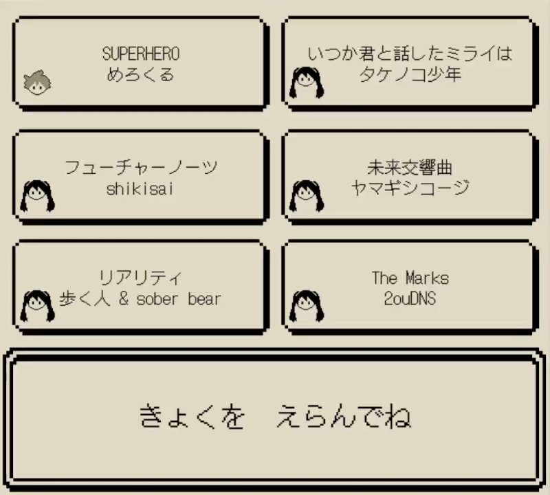
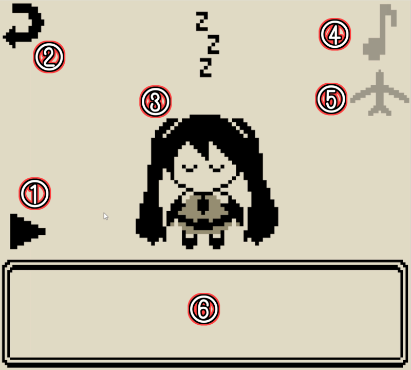
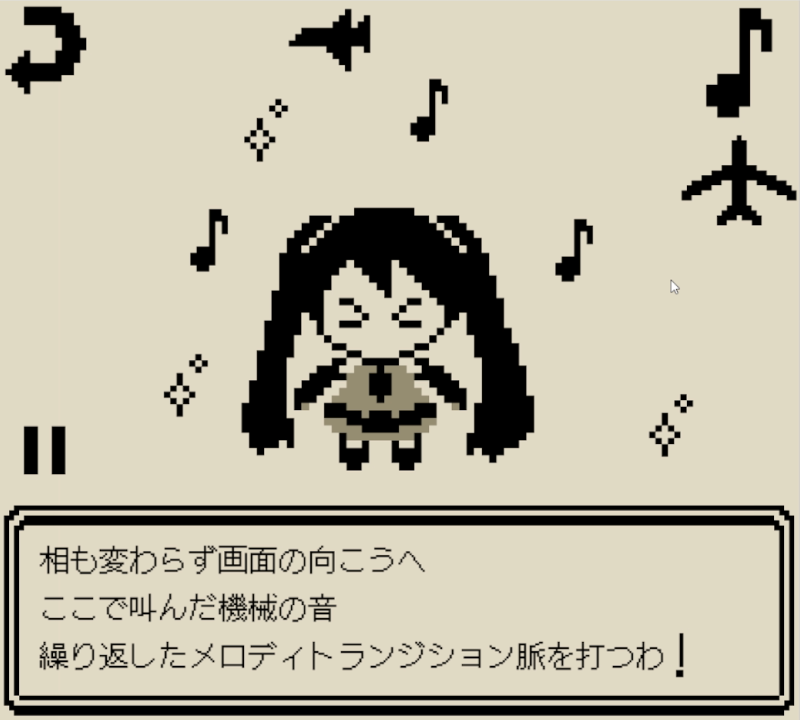

# 『初音ミク「マジカルミライ 2024」プログラミング・コンテスト』応募作品「ピコピコオンステージ！」
## 概要
ドット絵で構成された画面上でキャラクターが踊ったり、タッチ操作等によって色々な演出を切り替えて楽しむことができる、  
どこか懐かしい雰囲気のアプリケーション(リリックアプリ)です。



## 操作方法
### 楽曲選択画面
アプリケーションを起動すると楽曲選択画面が表示され、再生したい楽曲を選択できます。  
現在再生できる楽曲は以下の6曲です。  
- [SUPERHERO / めろくる](https://www.youtube.com/watch?v=EWGe3KRc144)
- [いつか君と話したミライは / タケノコ少年](https://www.youtube.com/watch?v=NbYwBs2FHvk)
- [フューチャーノーツ / shikisai](https://www.youtube.com/watch?v=y3_eKUvco2g)
- [未来交響曲 / ヤマギシコージ](https://www.youtube.com/watch?v=iQ_9pxVsRAo)
- [リアリティ / 歩く人 & sober bear](https://www.youtube.com/watch?v=mdYmFTcH5KI)
- [The Marks / 2ouDNS](https://www.youtube.com/watch?v=zBmGISSf6X8)



### プレイヤー画面
楽曲を選択し、読み込みが完了するとプレイヤー画面が表示されます。



1. START/STOPボタン  
1度押すごとに再生/一時停止が切り替わります。
2. BACKボタン  
1度押すと楽曲選択画面に戻ります。
3. キャラクター  
停止時は寝ていますが再生が始まると起きて踊ります。つつくと…？
4. 音符エフェクトボタン  
オンにすると再生時にキャラクターの周りにリズムに合わせて音符が出現するようになります。
5. 飛行機エフェクトボタン  
オンにすると再生時に画面上部にリズムに合わせて飛行機が出現するようになります。
6. テキストウィンドウ  
再生時はここに歌詞が表示されます。  
楽曲に合わせてスクロールされていきます。



全てのエフェクトをオンにするとこのような感じになります。  
サビに入るとキャラクターの表情が変わり、演出が追加されます。  

## アプリケーションの特徴
- キャラクターのアニメーション、演出、スクロールなど様々な要素が楽曲に合わせてタイミングよく表示されるようにしています。
- 各要素をドット絵かつ4階調で統一することによってレトロゲームのような雰囲気を演出しています。各ドット絵は自作です。
- 画面をクリックすることで演出の切り替えやキャラクターの反応などを楽しむことができます。
- 楽曲のサビを検出して特別な演出が表示されるようにしています。

## アプリケーション
- http://hbkmuseum.starfree.jp/mmprocom2024_pos/docs/index.html

## 紹介動画
- https://youtu.be/QaTZDjgD0Wk

## 動作方法
### 開発

[Node.js](https://nodejs.org/) をインストールしている環境で以下のコマンドを実行すると、開発用サーバが起動します。

```sh
npm install
npm run dev
```

### ビルド

以下のコマンドで `docs` 以下にビルド済ファイルが生成されます。

```sh
npm run build
```

ビルド済ファイルをサーバに配置することでアプリケーションが動作します。
また、サンプルとしてsampleフォルダにビルド済ファイルを置いています。

## 動作確認済環境
- PC Chrome
- Android Chrome

## TextAlive App API


TextAlive App API は、音楽に合わせてタイミングよく歌詞が動くWebアプリケーション（リリックアプリ）を開発できるJavaScript用のライブラリです。

TextAlive App API について詳しくはWebサイト [TextAlive for Developers](https://developer.textalive.jp/) をご覧ください。
